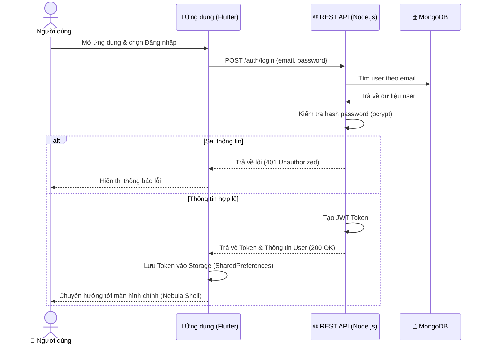
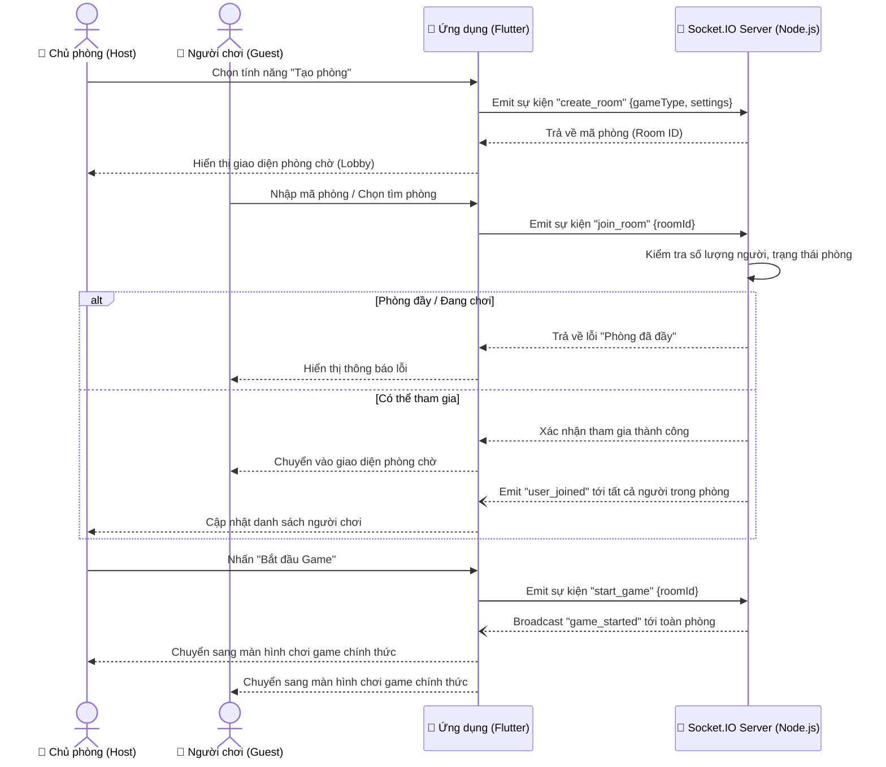
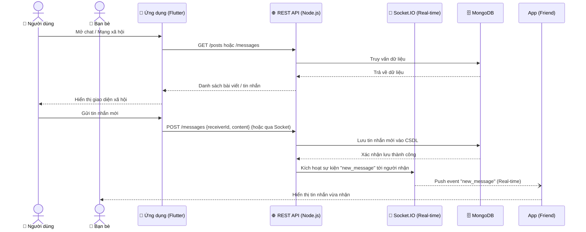
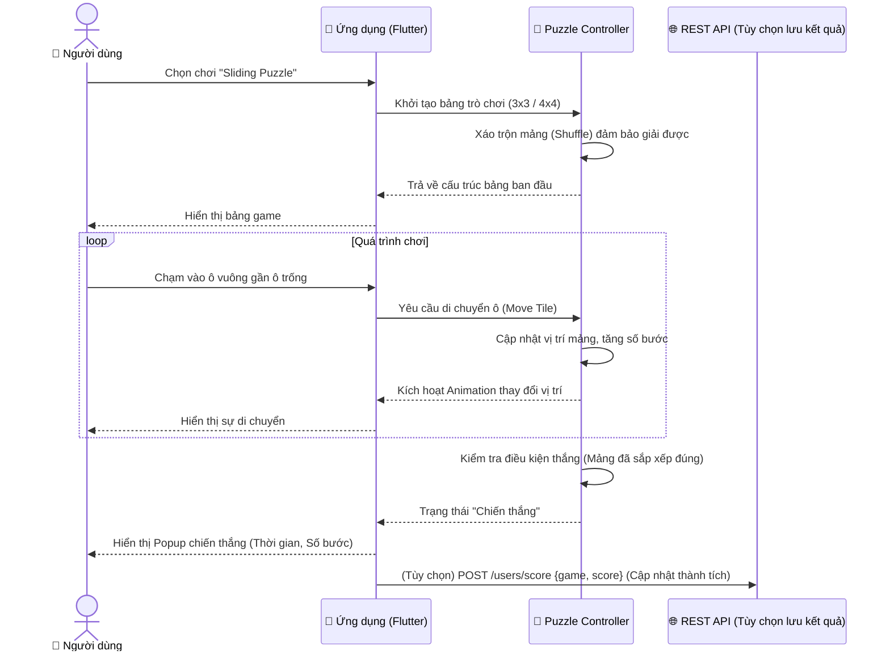

# Các Luồng Hoạt Động Chính (Sequence Diagrams)

Dựa trên cấu trúc dự án (REST API & Socket.IO), dưới đây là các biểu đồ tuần tự (Sequence Diagram) thể hiện các luồng nghiệp vụ quan trọng nhất của hệ thống Sân Chơi Board Game Xã Hội, được trình bày theo mẫu bạn yêu cầu.

## 1. Luồng Xác thực (Đăng nhập / Đăng ký)
Luồng này xử lý việc người dùng truy cập ứng dụng, gọi API xác thực và lưu trữ JWT token để sử dụng cho các tính năng khác.

## 2. Luồng Phòng Chơi Đa Người Chơi (Multiplayer Room - Socket.IO)
Luồng này sử dụng WebSockets (Socket.IO) để tạo kết nối theo thời gian thực (real-time) giữa những người chơi trong cùng một phòng game (như Ma Sói, Vẽ và Đoán...).

## 3. Luồng Mạng Xã Hội và Tin Nhắn
Luồng hoạt động khi người dùng đăng bài viết mới hoặc nhắn tin cá nhân/cộng đồng.

## 4. Luồng Chơi Mini-Game Cục Bộ (Ví dụ: Sliding Puzzle)
Mini-game này hoạt động chủ yếu dựa trên logic ở Client (Flutter) mà không cần gọi API liên tục.

